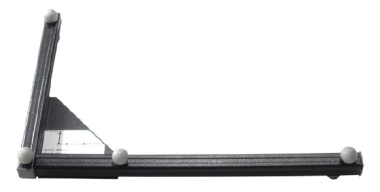
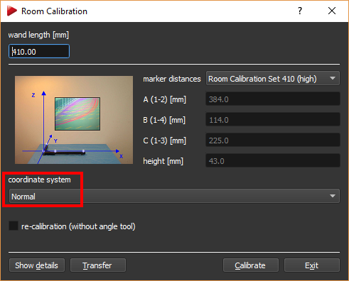
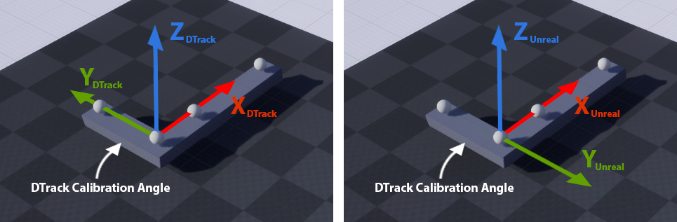
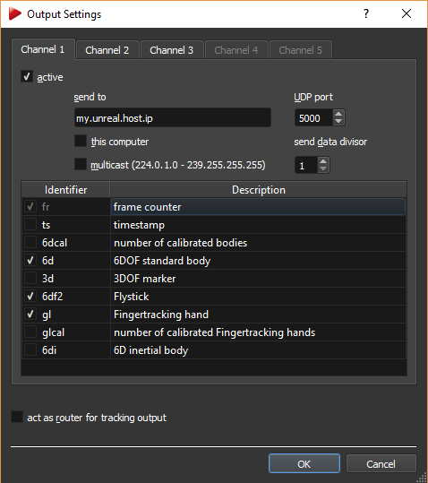

# DTrack Plugin for Unreal Engine 4/5

This is a plug-in for the Unreal Engine with the purpose of native integration of the [Advanded Realtime Tracking][1] _DTrack_ tracking solutions. It injects data into the engine through LiveLink. Data can be accessed through Blueprint or C++. The plugin currently supports the DTrack body`6d`and flystick`6df2` as well as the finger tracking `gl` data format.

## Prerequisites

- Unreal Engine 4 (tested with 4.27), Unreal Engine 5 (5.0.2 or later)
- Windows
- Microsoft Visual Studio. See the [Unreal documentation][2] for selecting and installing the correct version.

## Installation

### Preparation

- The plugin is prepared to run with Unreal Engine 5. If you want to use it with Unreal Engine 4, you have to manually remove the entry _"LiveLinkAnimationCore",_ from the file _Source\DTrackPlugin\DTrackPlugin.Build.cs_.

### Install into the global Engine plugin folder
- Compile the plugin manually:
    *&lt;UEDir&gt;\Engine\Build\BatchFiles\RunUAT.bat* BuildPlugin -Plugin=*/Path/to/DTrackPlugin.uplugin* -TargetPlatforms=Win64 -Package=*&lt;OutDir&gt;* -Rocket *&lt;VS-version&gt;*
    Here *&lt;VS-version&gt;* designates the Visual Studio version chosen above (e.g. -VS2022).
- Copy the folder *&lt;OutDir&gt;* to *&lt;UE4Dir&gt;\Engine\Plugins\DTrackPlugin*

### Alternatively install into your local project plugin folder
- Open the _Unreal Editor_ and create an Unreal C++ project
- Copy the plugin to *&lt;project&gt;\Plugins\DTrackPlugin*
- Compilation then takes place automatically when starting your Unreal project

## DTrack Configuration

### Room Calibration

For general information about the DTrack room calibration and room adjustment see the DTrack User Manual.
Here we discuss details relevant for use with the Unreal Engine.

The calibration angle which comes with your ART tracking system defines the coordinate system layout in your tracking area.
It consists of four retroreflective or active markers mounted onto a L-shaped frame.

The marker in the edge of this L-shape by default designates the origin of the DTrack coordinate system.
When using the _Normal_ calibration mode, the long arm of this L-shape corresponds to the X axis, the short arm to the Y axis.
DTrack coordinates refer to a right-handed coordinate system, so when the angle is placed flat on the ground with the markers on top the Z axis points upwards.

You can change orientation and position of the DTrack coordinate system with respect to the calibration angle via _Tracking > Room adjustment_ in the DTrack UI.

The plugin transforms a right-handed position of a DTrack 6DoF measurement to a left-handed Unreal position  by inverting the Y axis:
***( XUnreal , YUnreal , ZUnreal ) = ( XDTrack , -YDTrack , ZDTrack )*** .
  

 

### DTrack Output Configuration

Via _Tracking > Output_ in the DTrack UI you can set up IP and port of the host of your _Unreal Editor_ or application.
In the corresponding dialog, you can also enable the DTrack output types `6d`, `6df2` and `gl`.

 

[1]
 

## Plugin Usage

See [UnrealDTrackSample][3] for a detailed example.

The mapping of Flystick buttons and joystick is listed in *DTrackFlystickInputDevice.cpp* within the *DTrackPlugin\Source\DTrackInput\Private* directory.

[1]: https://ar-tracking.com/
[2]: https://docs.unrealengine.com/5.0/en-US/setting-up-visual-studio-development-environment-for-cplusplus-projects-in-unreal-engine
[3]: https://www.github.com/ar-tracking/UnrealDTrackSample
